# College CarClinch AI

AI-powered Car Recommendation and Dealership Management System

## System Architecture

The following diagram shows the high-level architecture of our AI-powered car recommendation system:

```mermaid
graph TB
    %% User Interface Layer
    subgraph "Presentation Layer"
        WEB[Web Application<br/>React/Vue/Angular]
        MOBILE[Mobile App<br/>React Native/Flutter]
        API_DOC[API Documentation<br/>Swagger/OpenAPI]
    end

    %% API Gateway
    subgraph "API Layer"
        GATEWAY[API Gateway<br/>Express.js/FastAPI]
        AUTH[Authentication Service<br/>JWT/OAuth2]
        RATE[Rate Limiting<br/>Redis]
    end

    %% Business Logic Layer
    subgraph "Application Services"
        USER_SVC[User Management<br/>Service]
        CAR_SVC[Car Management<br/>Service]
        CLINCH_SVC[CarClinch AI<br/>Core Service]
        NOTIFICATION[Notification<br/>Service]
    end

    %% AI/ML Components
    subgraph "AI/ML Pipeline"
        MODEL_SERVE[Model Serving<br/>TensorFlow Serving/MLflow]
        INFERENCE[Inference Engine<br/>PyTorch/TensorFlow]
        MODEL_STORE[Model Store<br/>MLflow Registry]
        
        subgraph "ML Models"
            PREDICT[Price Prediction<br/>Model]
            RECOMMEND[Recommendation<br/>Engine]
            IMAGE_PROC[Image Recognition<br/>CNN Model]
            NLP[Text Analysis<br/>NLP Model]
        end
    end

    %% Data Processing Layer
    subgraph "Data Processing"
        ETL[ETL Pipeline<br/>Apache Airflow]
        STREAM[Stream Processing<br/>Apache Kafka]
        BATCH[Batch Processing<br/>Apache Spark]
        FEATURE[Feature Engineering<br/>Pipeline]
    end

    %% Storage Layer
    subgraph "Data Storage"
        PRIMARY_DB[(Primary Database<br/>PostgreSQL/MongoDB)]
        CACHE[(Cache Layer<br/>Redis)]
        SEARCH[(Search Engine<br/>Elasticsearch)]
        FILE_STORE[(File Storage<br/>AWS S3/MinIO)]
        ML_DATA[(ML Data Store<br/>Feature Store)]
    end

    %% External Services
    subgraph "External APIs"
        CAR_API[Car Data APIs<br/>KBB/Edmunds]
        PAYMENT[Payment Gateway<br/>Stripe/PayPal]
        MAPS[Maps API<br/>Google Maps]
        EMAIL[Email Service<br/>SendGrid]
    end

    %% Monitoring & DevOps
    subgraph "Infrastructure"
        MONITOR[Monitoring<br/>Prometheus/Grafana]
        LOGS[Logging<br/>ELK Stack]
        CI_CD[CI/CD Pipeline<br/>GitHub Actions]
        CONTAINER[Containerization<br/>Docker/Kubernetes]
    end

    %% Data Sources
    subgraph "Data Sources"
        USER_DATA[User Generated<br/>Data]
        CAR_DATA[Car Listings<br/>Data]
        MARKET_DATA[Market Data<br/>APIs]
        IMAGE_DATA[Car Images<br/>Upload]
    end

    %% Connections - User Flow
    WEB --> GATEWAY
    MOBILE --> GATEWAY
    GATEWAY --> AUTH
    GATEWAY --> RATE
    
    %% API to Services
    GATEWAY --> USER_SVC
    GATEWAY --> CAR_SVC
    GATEWAY --> CLINCH_SVC
    GATEWAY --> NOTIFICATION
    
    %% Services to AI/ML
    CAR_SVC --> MODEL_SERVE
    CLINCH_SVC --> INFERENCE
    CLINCH_SVC --> PREDICT
    CLINCH_SVC --> RECOMMEND
    
    %% AI/ML Model Management
    MODEL_SERVE --> MODEL_STORE
    INFERENCE --> PREDICT
    INFERENCE --> RECOMMEND
    INFERENCE --> IMAGE_PROC
    INFERENCE --> NLP
    
    %% Data Processing Flow
    USER_DATA --> ETL
    CAR_DATA --> STREAM
    MARKET_DATA --> BATCH
    IMAGE_DATA --> FEATURE
    
    ETL --> PRIMARY_DB
    STREAM --> ML_DATA
    BATCH --> SEARCH
    FEATURE --> ML_DATA
    
    %% Storage Connections
    USER_SVC --> PRIMARY_DB
    CAR_SVC --> PRIMARY_DB
    CLINCH_SVC --> ML_DATA
    NOTIFICATION --> CACHE
    
    %% File and Search
    IMAGE_PROC --> FILE_STORE
    CAR_SVC --> SEARCH
    USER_SVC --> CACHE
    
    %% External API Connections
    CAR_SVC --> CAR_API
    USER_SVC --> PAYMENT
    CAR_SVC --> MAPS
    NOTIFICATION --> EMAIL
    
    %% Monitoring
    GATEWAY --> MONITOR
    MODEL_SERVE --> LOGS
    INFERENCE --> MONITOR
    PRIMARY_DB --> MONITOR
    
    %% Styling
    classDef frontend fill:#e1f5fe
    classDef api fill:#f3e5f5
    classDef service fill:#e8f5e8
    classDef ai fill:#fff3e0
    classDef data fill:#fce4ec
    classDef storage fill:#f1f8e9
    classDef external fill:#fff8e1
    classDef infra fill:#efebe9
    
    class WEB,MOBILE,API_DOC frontend
    class GATEWAY,AUTH,RATE api
    class USER_SVC,CAR_SVC,CLINCH_SVC,NOTIFICATION service
    class MODEL_SERVE,INFERENCE,MODEL_STORE,PREDICT,RECOMMEND,IMAGE_PROC,NLP ai
    class ETL,STREAM,BATCH,FEATURE,USER_DATA,CAR_DATA,MARKET_DATA,IMAGE_DATA data
    class PRIMARY_DB,CACHE,SEARCH,FILE_STORE,ML_DATA storage
    class CAR_API,PAYMENT,MAPS,EMAIL external
    class MONITOR,LOGS,CI_CD,CONTAINER infra
```



### Architecture Highlights:

- **🌐 Presentation Layer**: Multi-platform user interfaces (Web & Mobile)
- **🔒 API Layer**: Secure gateway with authentication and rate limiting
- **⚙️ Application Services**: Microservices for core business logic
- **🤖 AI/ML Pipeline**: Advanced machine learning models for predictions and recommendations
- **📊 Data Processing**: Real-time and batch processing capabilities
- **💾 Data Storage**: Multi-database architecture for different data types
- **🔌 External APIs**: Integration with third-party services
- **📈 Infrastructure**: Comprehensive monitoring and DevOps tools

## 1. Detailed Overview of Project Structure 

```
college-carclinch-ai/
├── README.md
├── .gitignore
├── backend/
│   ├── app.py
│   ├── requirements.txt
│   ├── models/
│   ├── routes/
│   ├── database/
│   └── utils/
├── frontend/
│   ├── package.json
│   ├── public/
│   └── src/
│       ├── components/
│       └── pages/
├── data/
├── scripts/
├── Dockerfile
├── docker-compose.yml
```

### Key Folders and Files

- **backend/**: Python (Flask/FastAPI) or Node.js API, ML models (`models/`), API endpoints (`routes/`), database logic, and utilities.
- **frontend/**: React (or Angular) UI, components, and pages for users and dealers.
- **data/**: Sample data files and scripts for seeding/testing.
- **scripts/**: Setup and management scripts.
- **Dockerfile/docker-compose.yml**: Containerization for easy deployment.

## 2. Folder & File Explanations

### Root

- **README.md**  
  Project introduction, setup instructions, and usage examples.
- **.gitignore**  
  Specifies files/folders for Git to ignore (logs, `node_modules`, compiled files, etc.).

### backend/

- **app.py**  
  Main entry point for the backend server (Flask/FastAPI/Express).
- **requirements.txt**  
  Python dependencies (Flask, scikit-learn, etc.).
- **models/**  
  Trained machine learning models (e.g., `recommendation_model.pkl`).
- **routes/**  
  API endpoint definitions:
  - **cars.py**: Handles car listing, adding, updating, deleting, etc.
  - **users.py**: Handles registration, login, user profiles.
  - **recommendations.py**: Handles AI-driven car recommendations.
- **database/**
  - **db_setup.py**: Code to initialize/connect to DB, run migrations/seeding.
- **utils/**
  - **helpers.py**: Utility functions, data validators, shared logic.

### frontend/

- **package.json**  
  Frontend dependencies (React, etc.).
- **public/index.html**  
  Main HTML file loaded by React.
- **src/index.js**  
  Root JavaScript entry point; renders the App.
- **src/App.js**  
  Main React application component.
- **src/components/**
  - **CarList.jsx**: Displays car listings.
  - **RecommendationPanel.jsx**: Shows recommended cars.
  - **DealerDashboard.jsx**: Dealer features, stats, and controls.
- **src/pages/**
  - **Home.js**: Landing page.
  - **Profile.js**: User account page.

### data/

- **cars_sample.csv**  
  Example car inventory dataset.
- **seed.py**  
  Script to load sample data into the database.

### scripts/

- **setup.sh**  
  Shell script for automating setup, installation, or cleanup tasks.

### Docker & Deployment

- **Dockerfile / docker-compose.yml**  
  Container definitions to build and run the app using Docker, simplifying deployment.


## Installation

1. **Clone the Repository**
    ```
    git clone https://github.com/lajak/college-carclinch-ai
    cd college-carclinch-ai
    ```

2. **Set Up Backend**
    ```
    cd backend
    pip install -r requirements.txt
    # or
    npm install
    ```

3. **Set Up Frontend**
    ```
    cd ../frontend
    npm install
    ```

4. **Run the Application**
    ```
    # Start backend (from backend/)
    python app.py
    # or
    npm run start

    # Start frontend (from frontend/)
    npm start
    ```

5. **Access the App**
    - Open your browser to `http://localhost:3000` (or as instructed).

## Technologies

- **Backend**: Python (Flask/FastAPI) or Node.js (Express)
- **Frontend**: ReactJS/Angular
- **AI/ML**: scikit-learn, pandas, or equivalent
- **Database**: PostgreSQL, MySQL, or MongoDB
- **DevOps**: Docker, Docker Compose

## AI/Recommendation Engine

- Utilizes machine learning for personalized car suggestions.
- Trained on historical user, preference, and inventory data.
- Continually improved as new data is added.

## Development & Deployment

- Run locally via Docker Compose:
    ```
    docker-compose up --build
    ```
- Or deploy backend and frontend separately (see above).
- Scripts in `/scripts` help automate setup and data loading.

## Contributing

1. Fork the repository.
2. Create your feature branch (`git checkout -b feature/fooBar`).
3. Commit your changes (`git commit -am 'Add some fooBar'`).
4. Push to the branch (`git push origin feature/fooBar`).
5. Open a Pull Request.

## License

This project is licensed under the MIT License – see the [LICENSE](LICENSE) file.

---
## flowchart TD
  %% User Interaction
  User[User: Customer Portal] -->|Browse cars, preferences| Frontend[Frontend React App]

  %% Frontend to Backend Communication
  Frontend -->|API Requests| Backend[Backend API Server]

  %% Backend API Endpoints
  Backend --> CarsAPI[Cars API: CRUD operations]
  Backend --> UsersAPI[Users API: Auth & Profile]
  Backend --> RecAPI[Recommendations API]

  %% Backend to Database
  CarsAPI --> DB[(Database: Inventory & User Data)]
  UsersAPI --> DB
  RecAPI --> DB

  %% AI/ML Model Integration
  RecAPI --> MLModel[Machine Learning Model: Recommendation Engine]
  MLModel --> RecAPI

  %% Backend Responds Back to Frontend
  Backend --> Frontend

  %% Dealer Dashboard Interaction
  DealerUI[Dealer Dashboard UI] -->|API Requests| Backend

  %% Data Loading and Updates
  DataSeed[Data Seeding & Updates (seed.py)] --> DB

  %% DevOps Pipeline (Optional)
  GitHub[GitHub Repo] --> CICD[CI/CD Pipeline]
  CICD --> Deployment[Deployment: Docker/Docker Compose]

  Deployment --> Frontend
  Deployment --> Backend
